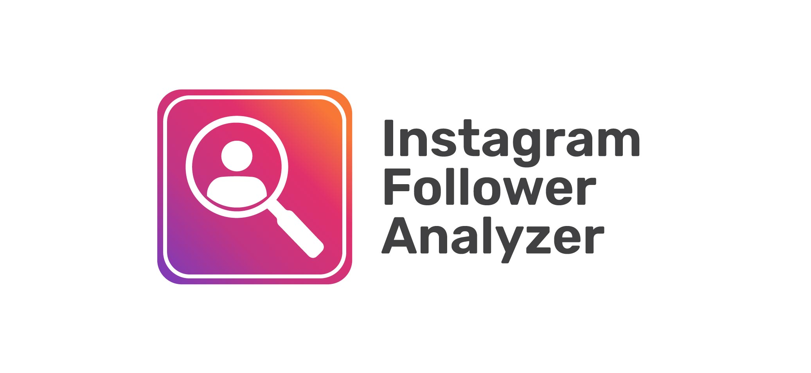

# Instagram Follower Analyzer

⚡ **Easily find out who doesn’t follow you back - and who you’ve missed!**

A lightweight and privacy-first tool to help you manage your Instagram followers and following manually. No login required. No data stored.

Just copy and paste your data - the tool does the rest!

---

## 🔗 Try It Now

👉 [Visit the Tool](https://themiu.github.io/Instagram-Follower-Analyzer/)

---

## ✅ Features

- See who you follow but they don’t follow you back
- Find users who follow you but you're not following
- Auto count total followers and following
- Clickable links to Instagram profiles
- Runs entirely in your browser - nothing is uploaded or tracked

---

## 🛡️ Privacy First

This tool works 100% offline in your browser.  
No accounts, no cookies, no data collection.  
Perfect for safe, manual account management.

---

## ⚠️ Usage Warning

Instagram may limit how many users you can follow or unfollow per day.  
Exceeding safe limits (typically 100–200 actions/day) can result in temporary blocks, feature restrictions, or account bans.  
Use this tool responsibly and do not attempt to bulk-follow or mass-unfollow users.

---

## 📜 Legal Note

This tool is for personal, educational, or research use only.  
Do not use it to analyze accounts you do not own.  
Always follow [Instagram’s Terms of Service](https://help.instagram.com/581066165581870).

---

Made with ⚙️ by [Kasun Miu](https://github.com/TheMIU)
